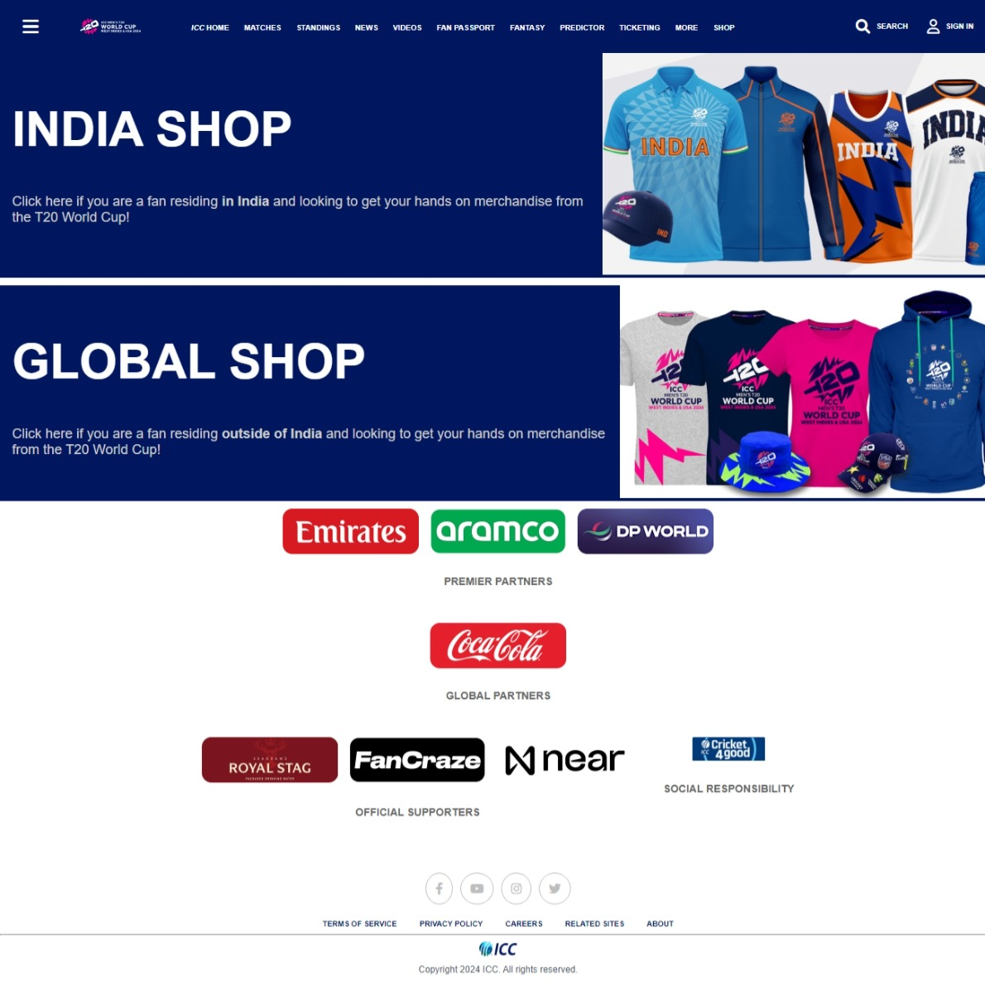

# 🎯 ICC (International Cricket Council) Shop Page 🏏

## 🚀 ICC Website Project

### 📌 Overview
Welcome to the **ICC (International Cricket Council) Shop Page** project! This project aims to replicate and enhance the "Shop Page" section of the ICC website. By recreating this section, we intend to showcase the platform's mission to promote and celebrate international cricket, its events, rankings, and awards.

### Home Page Consists of:
2. **Navbar**
3. **Shopping Items Section**
8. **Footer**

In all these sections, we aim to mirror the original ICC website's "Shop Page."

### Key Features:
- **Responsive Design:** Ensure the layout is visually appealing and functional on various devices.
- **Content Accuracy:** Accurately represent the ICC's core content, such as rankings, videos, and news.
- **Consistent Styling:** Maintain a consistent look and feel, aligned with the official ICC branding.

### Tech Stack
- **HTML**
- **CSS**

### Acknowledgement
I would like to express my gratitude to everyone who contributed to the development of this ICC website project.

### Project Contributor
- **<u>Atif</u>**: Responsible for development and execution of the ICC Home Page.

### Project Mentor
I would like to sincerely thank **<u>Abhinandan Kumar</u>**, our project mentor, for his constant guidance and support throughout the completion of the ICC website clone project. His advice and encouragement were crucial in helping us complete the project successfully.

### Special Thanks
We extend our gratitude to the original ICC website development team for creating an inspiring platform that served as the foundation for this project.

### Learning Resources
A heartfelt thank you to **Geekster** for providing invaluable learning resources that equipped us with the skills and knowledge necessary for the successful completion of this project.

## 💥 Project Output

Here is a screenshot of the ICC website project:

